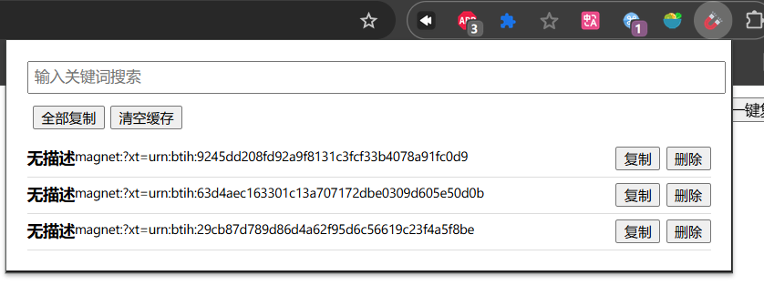
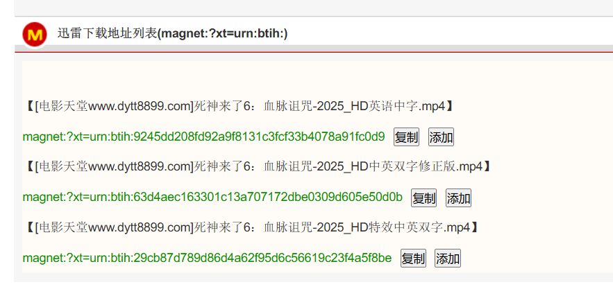

# Magnet 磁力链接助手

Magnet 磁力链接助手是一款 Chrome 扩展程序，旨在帮助用户更便捷地管理网页上的磁力链接。该扩展可以自动识别页面中的磁力链接，并提供一键添加、复制等功能，方便用户快速将链接保存到缓存或复制到剪贴板。

## 主要功能
- **自动识别**：自动检测页面文本和 `<a>` 标签中的磁力链接。
- **一键操作**：支持一键添加所有链接到缓存，一键复制所有链接。
- **单个操作**：为每个磁力链接提供添加到缓存和复制功能的按钮。
- **数据持久化**：使用 `chrome.storage` 实现数据持久化，跨 Tab 同步数据。
- **链接管理**：在扩展弹出窗口中查看、复制、删除和清空缓存中的磁力链接。

## 项目结构
```
├── .gitignore
├── README.md
├── background.js       # 后台脚本，处理数据存储和消息通信
├── content.js          # 内容脚本，识别和处理页面上的磁力链接
├── icons               # 扩展图标
│   ├── magnet.png
│   └── magnet.svg
├── manifest.json       # 扩展配置文件
├── popup.html          # 扩展弹出窗口页面
└── popup.js            # 弹出窗口页面逻辑
```
### 效果图引用
在项目中，我们可以通过以下方式引用效果图：






## 使用方法
1. 下载项目代码并解压。
2. 打开 Chrome 浏览器，访问 `chrome://extensions`。
3. 开启“开发者模式”，点击“加载已解压的扩展程序”，选择项目文件夹。
4. 访问包含磁力链接的网页，即可看到自动添加的操作按钮。
5. 点击扩展图标，可在弹出窗口中管理缓存的磁力链接。